# NativeOS

**把你看过的英语,变成你说得出来的英语。**

---

## 这是什么

NativeOS 是一个练英语口语的 App。

大多数英语学习 App 的路径是:背单词 → 背句型 → 看视频 → 说不出来。
NativeOS 想做一件不一样的事:把"看"变成"用"。
输入端用场景化的真实视频帮你理解,输出端用 AI 角色陪你练到能开口,然后用间隔重复复习,别让你忘掉。

适合谁:**想练英语口语,不想再背单词表的人**。

## 五步法

口语学习被我们拆成五步,每一步都不可省:

1. **场景化视频输入**。选一段适合你水平的真实视频。
2. **盲听磨耳朵**。不查、不停、不看字幕,听到能听懂大致内容为止。
3. **精听逐句**。逐句循环,点生词即查,收藏值得反复看的句子。
4. **影子跟读**。按住麦克风,跟字幕同步说一遍。跟读的目的不是发音完美,是让大脑**同时理解和产出**。
5. **AI 对练 + 复习**。和 AI 角色在真实场景里完成任务(点咖啡、面试、投诉、看病…),然后 FSRS 按你的记忆状态安排复习。

70% 时间给精听磨耳朵,30% 给跟读复述。坚持不中断,是这套方法生效的唯一前提。

## 我们不一样的地方

- **i+1 输入**。按 CEFR(A1–C2)+ 视频难度帮你匹配,不会让你看太难的美剧,也不会让你背太简单的词表。
- **难度三档**。AI 对练分 B1 宽容 / B2 标准 / C1 地狱,同一个 NPC 三种阻力,自己挑。
- **母语靠后**。中文翻译藏在 2 次点击 + 触觉警告之后,默认全英文。这是刻意的。
- **跟读不评判发音**。跟读的目的是让大脑边听边产出,**不是练播音腔**。
- **离线可用**。词卡、复习进度、收藏的视频都在本地,网络断了 App 还能用。
- **不强制注册**。不登录也能用核心功能,登录只是开云端同步。

## 你能用它做什么

**看视频跟练。** 选一段适合你水平的视频,先盲听磨耳朵,再精听逐句循环。遇到生词点一下查,整段收藏直接进复习队列。

**跟读打分。** 字幕同步,按住麦克风跟读同一段。App 给你打分,差在哪(语法 / 词汇 / 语体 / 搭配),错的说法变卡片、正确的说法入库。

**和 AI 角色练口语。** 每天 8 个场景由 AI 自动生成,NPC 有名字、有背景、有任务目标。难度三档:B1 宽容 / B2 标准 / C1 地狱。说错 AI 不评判,但会自动纠正并归档。

**沉浸式沙箱。** 想再进一步?标准版基础上叠一层 Live2D 角色,角色会随对话做口型。

**自带视频。** 不想用官方内容?从手机本地或百度网盘导入自己的视频,App 自动转字幕、生成对练卡片。

**间隔重复复习。** 你收藏的所有词卡、对话中的好句子、AI 纠正过的表达,FSRS 按你的记忆状态排好复习队列。每天打开有该看的就去看。

## 看图

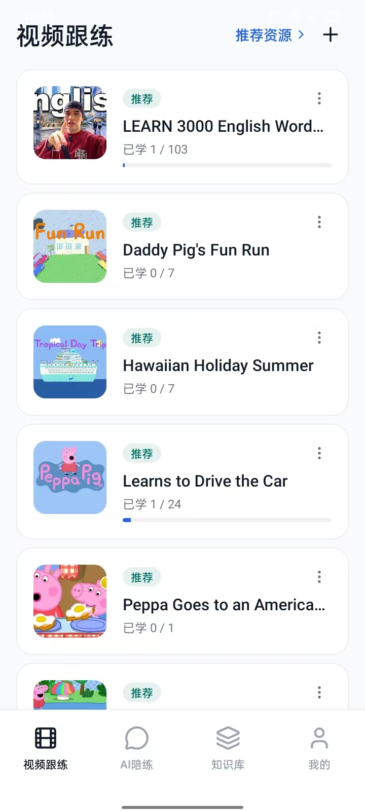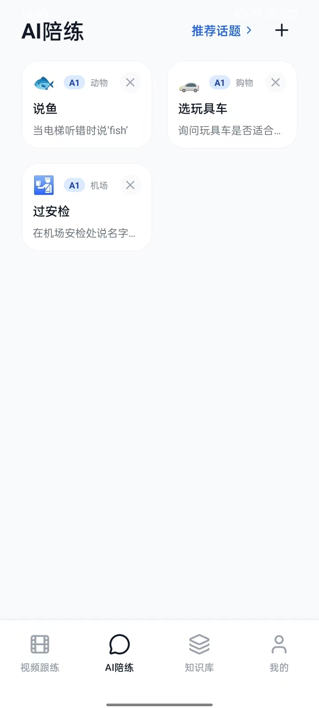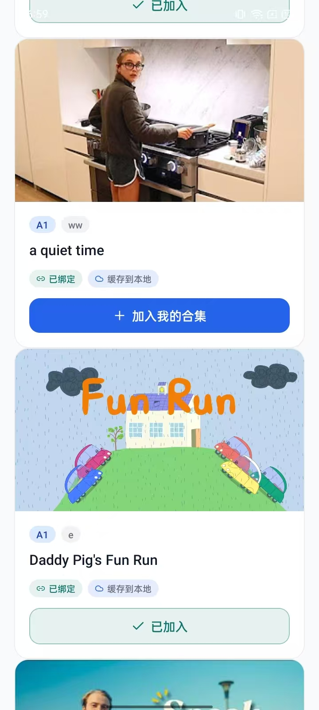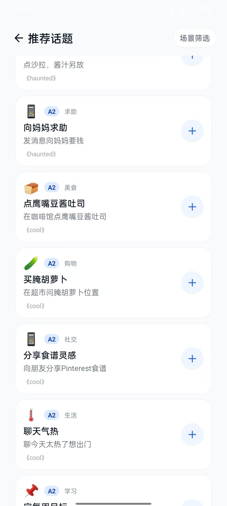

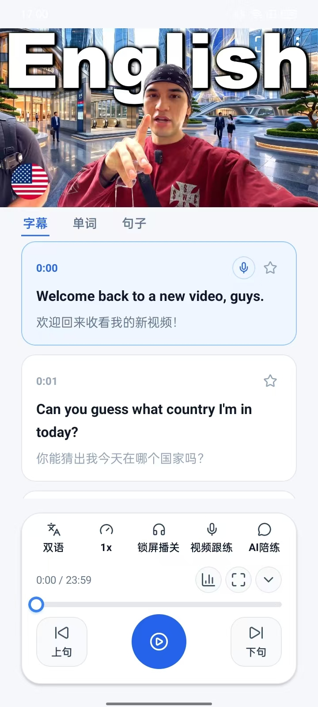

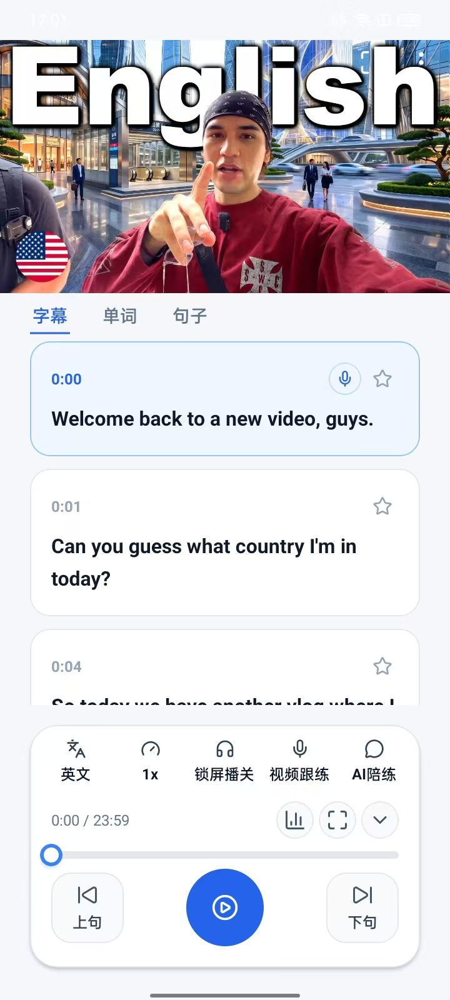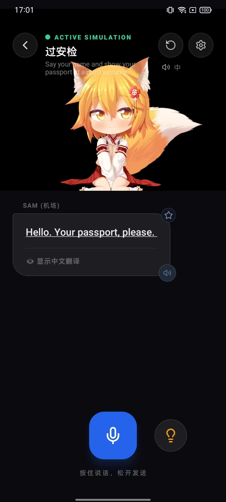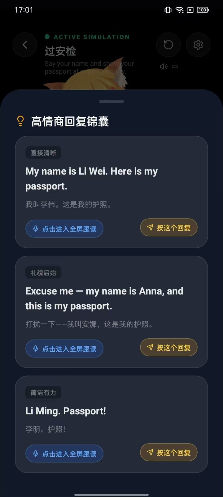

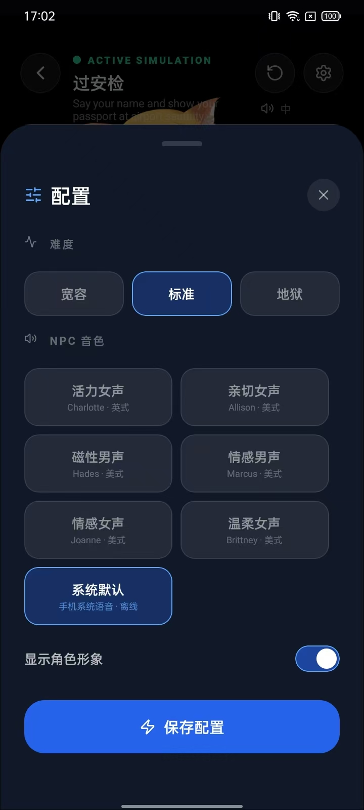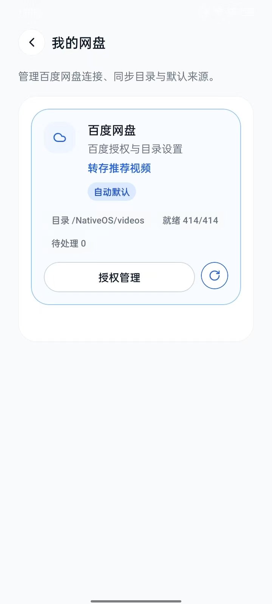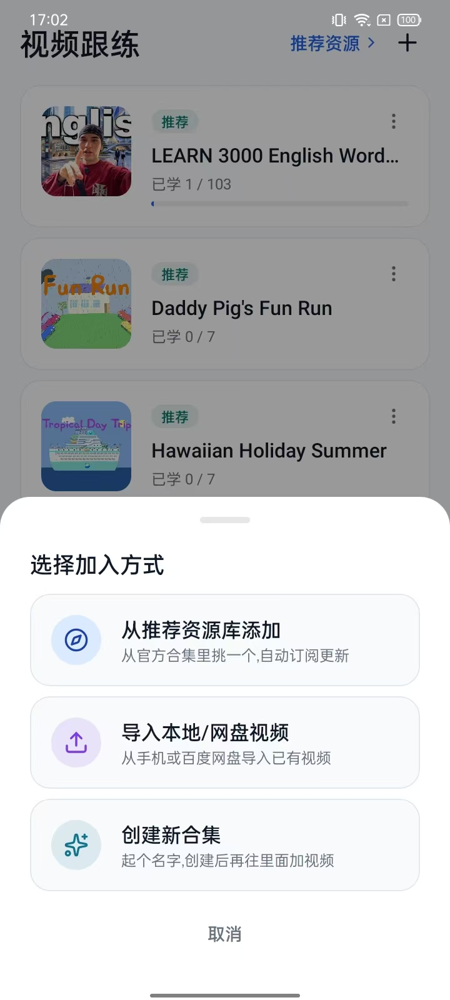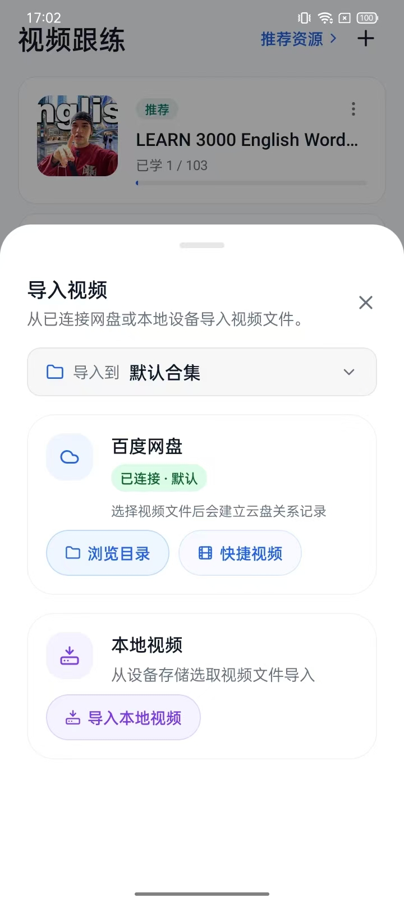

## 怎么开始

**用户**:去官网 [tofitit.com](https://tofitit.com) 下载 Android 版。

**开发者**:目录:

| 目录 | 是干嘛的 |
|---|---|
| `rn-app/` | 主 App,**大多数情况下你需要的就是这个** |
| `website/` | 官网源码 |
| `videoinfo-gengui/` | 内容运营后台(普通用户不需要) |
| `supabase/` | 云端数据库迁移|

跑 App 的命令:`setup.ps1`(一次),然后 `dev-start.ps1`(日常)。

**源代码**:
[GitHub](https://github.com/liwanzhong/nativeos) · [Gitee](https://gitee.com/kanglefu/nativeos)(国内镜像)

## 下一步

我们要做的:

- **网页版**。在浏览器里也能练口语,不用装 App。
- **Pad 版**。大屏适配,跟读和 AI 对练更舒服。
- **更多英语学习视频资源**。官方内容库继续扩,导入自己的视频也更容易。
- **优化划词词典**。让点词查词更快、更准,覆盖更多词。

